# RBAC Middleware Architecture

## System Architecture Diagram

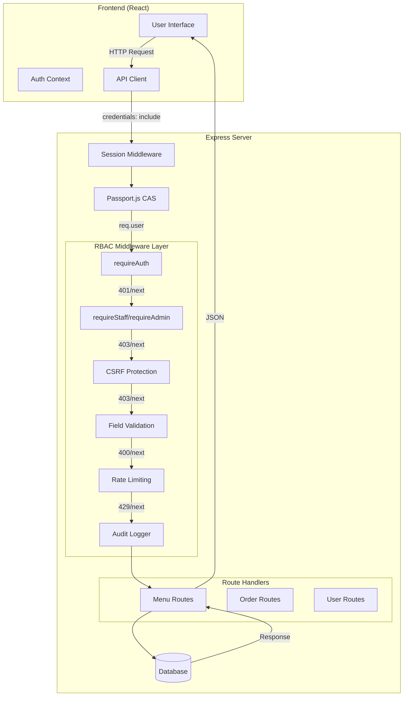

## Request Flow Sequence

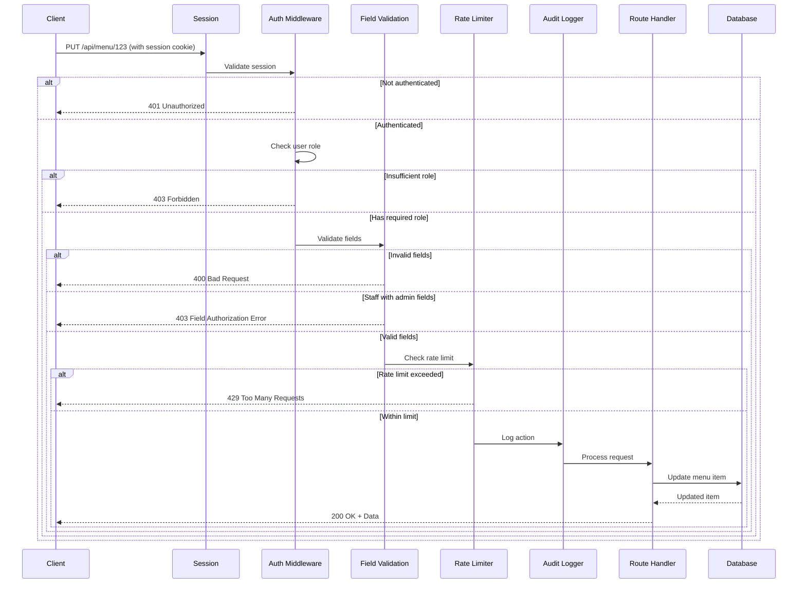

## Role Hierarchy

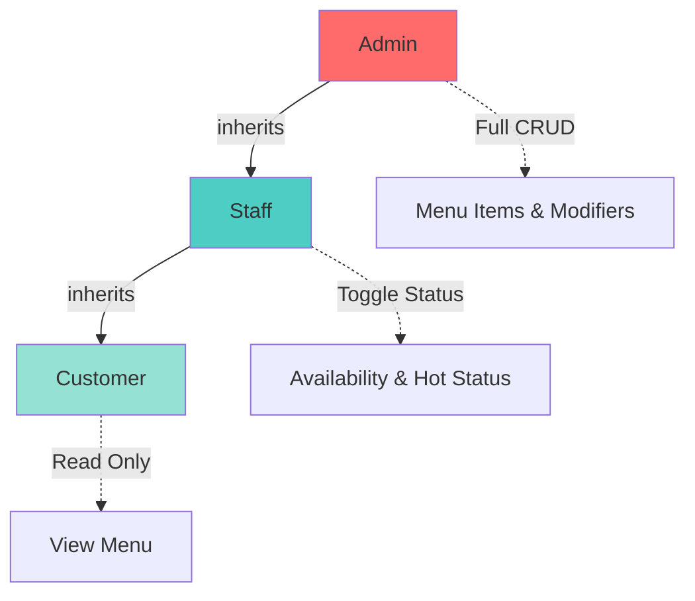

## Field-Level Permissions

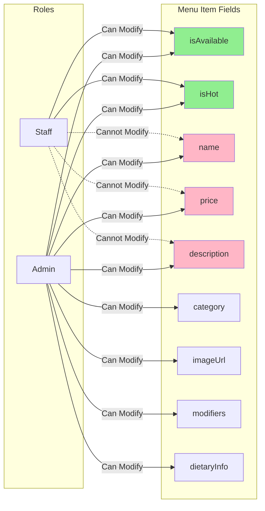

## Middleware Stack Order

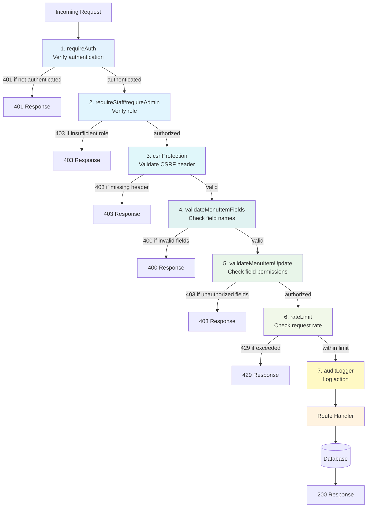

## Security Layers

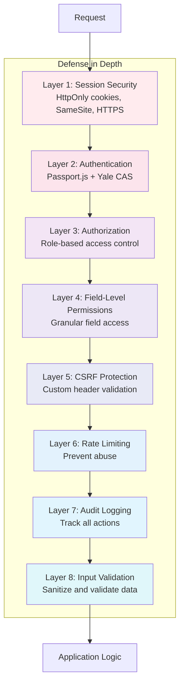

## Audit Log Data Flow

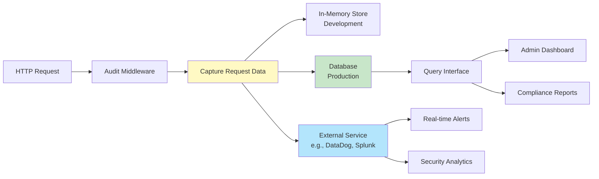

## Error Response Flow

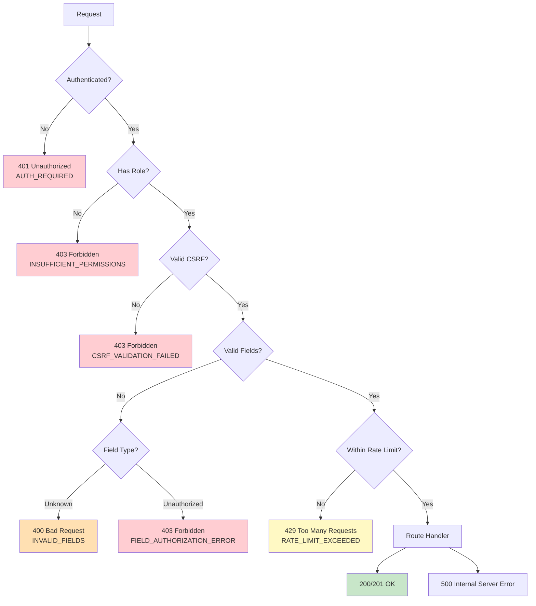

## Rate Limiting Architecture

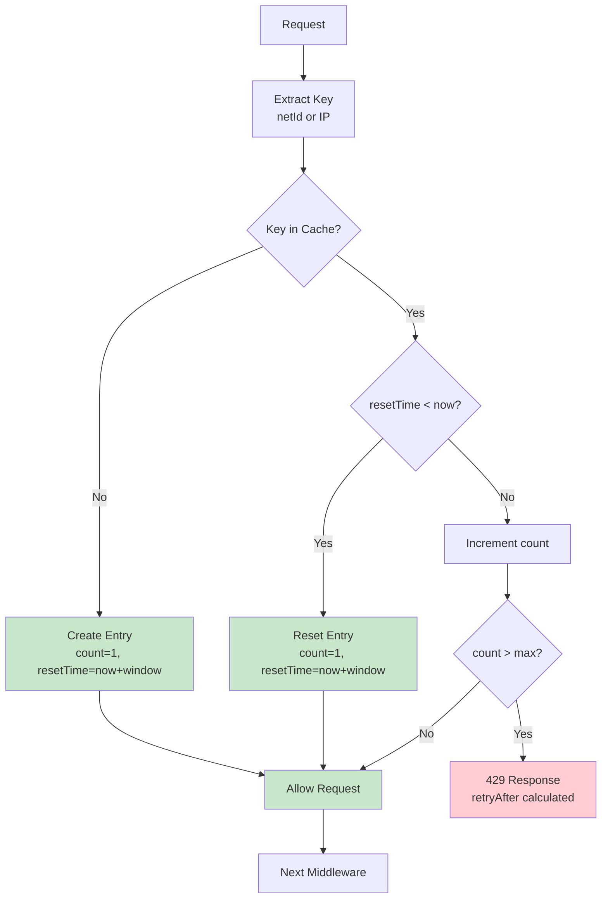

## Session Flow

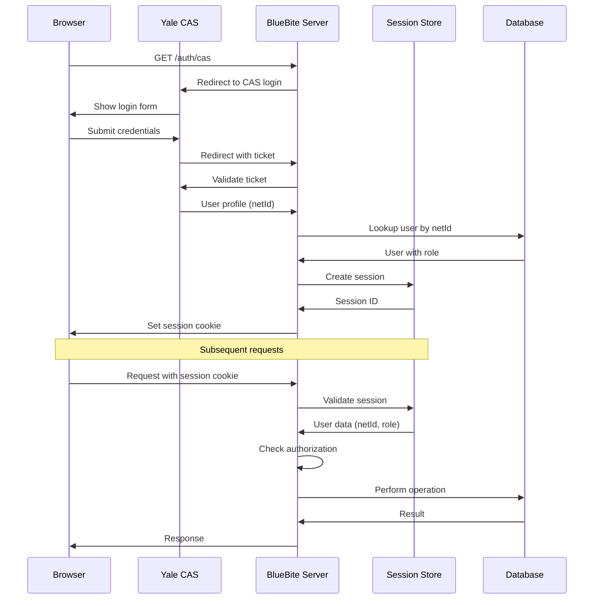

## Production Architecture

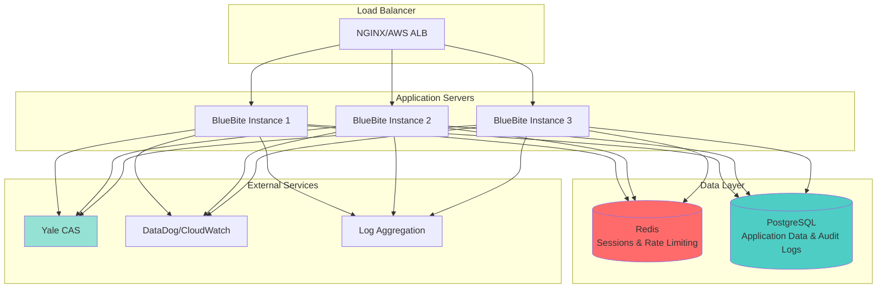

## Key Design Principles

### 1. Defense in Depth
Multiple layers of security ensure that if one layer is compromised, others still protect the system.

### 2. Fail Secure
When middleware detects a security violation, it immediately rejects the request rather than attempting recovery.

### 3. Least Privilege
Users receive the minimum permissions necessary to perform their tasks. Staff can only modify operational flags, not structural data.

### 4. Separation of Concerns
Each middleware has a single responsibility:
- Authentication: Verify identity
- Authorization: Verify permissions
- Field validation: Verify input structure
- Rate limiting: Prevent abuse
- Audit logging: Record actions

### 5. Explicit Over Implicit
All security decisions are explicit. No "default allow" behavior. Middleware explicitly checks and explicitly rejects or allows.

### 6. Auditability
All actions are logged with sufficient detail to reconstruct what happened, when, and by whom.

### 7. Zero Trust
Every request is fully validated regardless of source. No assumptions about client behavior.

## Performance Considerations

### Middleware Order Optimization
1. **Cheapest first**: Authentication check (session lookup) before expensive operations
2. **Early rejection**: Reject unauthorized requests before rate limiting or logging
3. **Caching**: Cache role checks in session to avoid repeated database lookups
4. **Async operations**: Audit logging should not block response

### Scaling Considerations
1. **Stateless middleware**: All middleware is stateless except for shared stores (Redis)
2. **Horizontal scaling**: Multiple app instances share Redis for sessions and rate limiting
3. **Database connection pooling**: Limit concurrent database connections
4. **CDN caching**: Cache public menu data at edge

## Security Best Practices

### Session Security
- HttpOnly cookies prevent XSS attacks
- SameSite prevents CSRF attacks
- Secure flag ensures HTTPS-only transmission
- Short expiration (24 hours) limits exposure

### CSRF Protection
- Custom header approach (simple, effective)
- SameSite cookie as defense in depth
- State-changing operations only (POST/PUT/PATCH/DELETE)

### Rate Limiting
- Per-user limits prevent individual abuse
- Global limits prevent DDoS
- Different limits for different roles
- Gradual backoff (retry-after header)

### Audit Logging
- Log all authenticated actions
- Include sufficient context (who, what, when, where)
- Immutable logs (append-only)
- Retention policy (compliance requirements)
- Sensitive data protection (don't log passwords, tokens)

## Compliance Considerations

### FERPA (Educational Records)
- Audit logs track access to student data
- Role-based access ensures only authorized personnel access records
- Session timeout enforces re-authentication

### GDPR (If Applicable)
- Audit logs support data access requests
- User data deletion supported
- Consent tracking possible via audit logs

### SOC 2 (If Applicable)
- Comprehensive audit logging
- Access control enforcement
- Security monitoring and alerting
